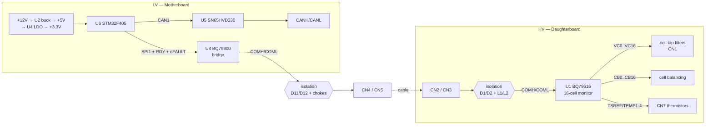

# Custom_BMS — Schematic & Netlist Reference

> **Generated file — do not hand-edit.** Regenerate with:
>
> ```sh
> python3 docs/extract_netlist.py && python3 docs/render_netlist.py
> ```

Board: **Custom_BMS** · 246 components · 204 nets · KiCad 9 hierarchical project.

## How this was built

Connectivity is taken from `production/netlist.ipc` (IPC-D-356), which records exact pin→net membership. Full net names come from `Custom_BMS.kicad_pcb`, which declares every net untruncated; the IPC file truncates names to 14 characters, keeping the *rightmost* characters, upper-casing them and replacing spaces with `?` (so `/BMS Chips/TSREF` appears as `MS?CHIPS/TSREF`). Component values, footprints, sheet assignment and pin names come from the six `*.kicad_sch` sheets and `production/bom.csv`.

**Caveat:** connectivity is derived from the **PCB**, so it reflects placed and routed copper. A part present only in the schematic would not appear here — see *Anomalies*.

## 1. Architecture

`Custom_BMS.kicad_sch` is a documentation/index sheet only: it contains **no hierarchical sheet pins**, so the six sub-sheets interconnect purely through **global labels and power symbols**. It draws two boxes that split the design into an isolated low-voltage side and high-voltage side.

| Sheet | File | Domain | Components |
|---|---|---|---|
| Comms Interfaces | `comms.kicad_sch` | LV (Motherboard) | 42 |
| MCU | `mcu.kicad_sch` | LV (Motherboard) | 63 |
| BMS Chips | `bms_chip.kicad_sch` | HV (Daughterboard) | 53 |
| Cell Tap Filters | `cell_tap.kicad_sch` | HV (Daughterboard) | 26 |
| Power | `power.kicad_sch` | LV (Motherboard) | 28 |
| Cell Balancing | `cell_balance.kicad_sch` | HV (Daughterboard) | 30 |

Responsibilities, quoted from the root sheet:

- **Motherboard (LV):** poll for faults, calculate segment-level info, determine safe to charge/discharge, read current sensor, compute resistance/SOC/SOH/SOP, communicate with the VCU, configure BMS chip registers and limits, POR reset of BMS chips.
- **Daughterboard (HV):** handle communication daisy chaining, fault handling over comms lines, heartbeat & comms fault detection, cell voltage measurement with filtering, temp sensing, report individual cell info.



## 2. Power tree

```
CN8 / VBAT ──► +12V ──► U2 TPS563300 (buck) ──► +5V ──► U4 AMS1117-3.3 (LDO) ──► +3.3V
```

| Rail | Pins on net | Notes |
|---|---|---|
| `+12V` | 16 |  |
| `+5V` | 8 |  |
| `+3.3V` | 29 |  |
| `VBAT` | 2 |  |
| `LV_GND` | 79 | LV-side ground |
| `GND` | 30 | HV-side ground (BMS Chips domain) |
| `CELL_TOP` | 5 |  |

> Note the design keeps **two separate grounds**: `LV_GND` on the motherboard side and `GND` on the BMS-chip (HV) side. They are not the same net — that separation is the isolation barrier.

## 3. Signal chains

### 3.1 MCU ↔ BQ79600 (SPI)

| Signal | U6 pin / port | U3 pin | Net | Series R / test point |
|---|---|---|---|---|
| MOSI | 23 / `PA7` | 4 | `SPI1_MOSI` | R56.2, TP8.1 |
| MISO | 22 / `PA6` | 5 | `SPI1_MISO` | R55.2, TP9.1 |
| SCLK | 21 / `PA5` | 6 | `SPI1_SCLK` | R57.2, TP10.1 |
| nCS | 20 / `PA4` | 7 | `SPI1_nSS` | R58.2 |
| SPI_RDY | 17 / `PA3` | 8 | `SPI_RDY` | R51.2, R53.1 |
| nFAULT | 41 / `PA8` | 2 | `nFAULT` | R52.2 |

### 3.2 Isolated daisy chain

Two differential pairs (COMH, COML) cross the isolation barrier on each side:

```
U1 BQ79616 pins 40-43 ─ R35-R40 / C43-C49 ─ L1,L2 (chokes) ─ D1,D2 (isolation) ─ CN2, CN3   [HV]
U3 BQ79600 pins 10-13 ─ R45-R50 / C53-C57 ─ D11,D12 (isolation) ────────────────── CN4, CN5   [LV]
```

| Net | Pins |
|---|---|
| `/BMS Chips/COMHN` | C44.1, R35.2, R37.1, U1.42 |
| `/BMS Chips/COMHN_ext` | CN2.2, D1.4, L1.4 |
| `/BMS Chips/COMHP` | C43.1, R35.1, R36.1, U1.43 |
| `/BMS Chips/COMHP_ext` | CN2.1, D1.6, L1.3 |
| `/BMS Chips/COMLN` | C49.1, R38.2, R40.1, U1.41 |
| `/BMS Chips/COMLN_ext` | CN3.2, D2.6, L2.3 |
| `/BMS Chips/COMLP` | C48.1, R38.1, R39.1, U1.40 |
| `/BMS Chips/COMLP_ext` | CN3.1, D2.4, L2.4 |
| `/Comms Interfaces/CANH` | D10.2, L6.1, R4.2, TP19.1, U5.7 |
| `/Comms Interfaces/CANL` | D10.1, L6.2, R5.1, TP20.1, U5.6 |
| `/Comms Interfaces/CAN_VREF` | C11.2, R4.1, R5.2, U5.5 |
| `/Comms Interfaces/COMHN_mb` | C53.1, R45.1, R46.1, U3.13 |
| `/Comms Interfaces/COMHN_mb_ext` | CN4.2, D11.6 |
| `/Comms Interfaces/COMHP_mb` | C54.1, R45.2, R47.1, U3.12 |
| `/Comms Interfaces/COMHP_mb_ext` | CN4.1, D11.4 |
| `/Comms Interfaces/COMLN_mb` | C56.1, R48.1, R49.1, U3.11 |
| `/Comms Interfaces/COMLN_mb_ext` | CN5.2, D12.6 |
| `/Comms Interfaces/COMLP_mb` | C57.1, R48.2, R50.1, U3.10 |
| `/Comms Interfaces/COMLP_mb_ext` | CN5.1, D12.4 |

### 3.3 CAN

| Net | Pins |
|---|---|
| `CAN1_RX` | TP11.1, U5.4, U6.44 |
| `CAN1_TX` | TP12.1, U5.1, U6.45 |

### 3.4 Cell sense and balancing

`VC0`…`VC16` are the cell-voltage sense inputs on U1; `CB0`…`CB16` are the balancing outputs. Cell taps arrive on CN1 and pass through the Cell Tap Filters sheet.

| Net | Pins |
|---|---|
| `CB0` | C37.1, C41.2, R29.2, U1.34 |
| `CB1` | C36.2, C41.1, R33.2, U1.32 |
| `CB2` | C36.1, C40.2, R28.2, U1.30 |
| `CB3` | C35.2, C40.1, R32.2, U1.28 |
| `CB4` | C35.1, C39.2, R27.2, U1.26 |
| `CB5` | C34.2, C39.1, R31.2, U1.24 |
| `CB6` | C34.1, C38.2, R26.2, U1.22 |
| `CB7` | C31.2, C38.1, R30.2, U1.20 |
| `CB8` | C31.1, C33.2, R23.2, U1.18 |
| `CB9` | C30.2, C33.1, R25.2, U1.16 |
| `CB10` | C30.1, C32.2, R22.2, U1.14 |
| `CB11` | C28.2, C32.1, R24.2, U1.12 |
| `CB12` | C28.1, C79.2, R20.2, U1.10 |
| `CB13` | C79.1, C80.2, U1.8 |
| `CB14` | C80.1, C81.2, U1.6 |
| `CB15` | C81.1, C82.2, U1.4 |
| `CB16` | C24.2, C82.1, U1.2 |
| `CELL1+` | CN1.1, R17.1, R33.1 |
| `CELL2+` | CN1.10, R16.1, R28.1 |
| `CELL3+` | CN1.2, R15.1, R32.1 |
| `CELL4+` | CN1.11, R14.1, R27.1 |
| `CELL5+` | CN1.3, R13.1, R31.1 |
| `CELL6+` | CN1.12, R12.1, R26.1 |
| `CELL7+` | CN1.4, R11.1, R30.1 |
| `CELL8+` | CN1.13, R10.1, R23.1 |
| `CELL9+` | CN1.5, R25.1, R9.1 |
| `CELL10+` | CN1.14, R22.1, R8.1 |
| `CELL11+` | CN1.6, R24.1, R7.1 |
| `CELL12+` | CN1.15, R20.1, R6.1 |
| `CELL1-` | CN1.9, R2.1, R29.1 |
| `VC0` | C72.1, C8.2, R2.2, U1.35 |
| `VC1` | C23.2, C8.1, R17.2, U1.33 |
| `VC2` | C19.2, C23.1, R16.2, U1.31 |
| `VC3` | C19.1, C22.2, R15.2, U1.29 |
| `VC4` | C18.2, C22.1, R14.2, U1.27 |
| `VC5` | C18.1, C21.2, R13.2, U1.25 |
| `VC6` | C17.2, C21.1, R12.2, U1.23 |
| `VC7` | C17.1, C20.2, R11.2, U1.21 |
| `VC8` | C16.2, C20.1, R10.2, U1.19 |
| `VC9` | C15.2, C16.1, R9.2, U1.17 |
| `VC10` | C13.2, C15.1, R8.2, U1.15 |
| `VC11` | C13.1, C14.2, R7.2, U1.13 |
| `VC12` | C14.1, R6.2, U1.11 |
| `VC13` | U1.9 |
| `VC14` | U1.7 |
| `VC15` | U1.5 |
| `VC16` | U1.3 |

## 4. IC pinouts

### U6 — STM32F405RGTx (main MCU)

`STM32F405RGTx` · footprint `Package_QFP:LQFP-64_10x10mm_P0.5mm` · sheet _MCU_ · LV (Motherboard) domain

| Pin | Name | Net | Connects to |
|---|---|---|---|
| 1 | `VBAT` | `unconnected-(U6-VBAT-Pad1)` | _(only pin on net)_ |
| 2 | `PC13` | `unconnected-(U6-PC13-Pad2)` | _(only pin on net)_ |
| 3 | `PC14` | `unconnected-(U6-PC14-Pad3)` | _(only pin on net)_ |
| 4 | `PC15` | `unconnected-(U6-PC15-Pad4)` | _(only pin on net)_ |
| 5 | `PH0` | `Net-(U6-PH0)` | C9.2, X1.2 |
| 6 | `PH1` | `Net-(U6-PH1)` | C71.2, X1.1 |
| 7 | `NRST` | `Net-(S1-B)` | C70.1, S1.2 |
| 8 | `PC0` | `unconnected-(U6-PC0-Pad8)` | _(only pin on net)_ |
| 9 | `PC1` | `unconnected-(U6-PC1-Pad9)` | _(only pin on net)_ |
| 10 | `PC2` | `unconnected-(U6-PC2-Pad10)` | _(only pin on net)_ |
| 11 | `PC3` | `unconnected-(U6-PC3-Pad11)` | _(only pin on net)_ |
| 12 | `VSSA` | `LV_GND` | C10.2, C11.1, C12.2, C26.2, C27.2, C29.2, C42.2, C53.2, C54.2, C55.2, C56.2, C57.2, C58.2, C59.2, C60.2, C61.2, C62.2, C63.2, C64.2, C65.2, C66.2, C67.2, C68.2, C69.2, C70.2, C71.1, C73.2, C74.2, C75.2, C76.2, C83.1, C84.1, C85.2, C86.2, C9.1, CN8.2, D10.3, D15.1, D16.1, D17.1, D18.1, D19.1, D20.1, D5.3, D7.3, J1.4, J4.3, Q3.2, Q4.2, Q5.2, Q6.2, Q7.2, R18.2, R19.2, R21.2, R3.2, R53.2, R57.1, R59.2, R61.2, R63.2, R65.2, R66.2, R68.2, R71.2, R72.2, R73.2, R75.2, R79.2, R82.1, S1.1, U2.4, U3.9, U4.1, U5.2, U7.2 |
| 13 | `VDDA` | `+3.3V` | C12.1, C29.1, C42.1, C62.1, C63.1, C64.1, C65.1, C66.1, C69.1, C85.1, D8.2, J1.1, J4.1, R51.1, R52.1, R55.1, R56.1, R58.1, R83.1, R84.1, TP6.1, U3.3, U4.2, U5.3 |
| 14 | `PA0` | `unconnected-(U6-PA0-Pad14)` | _(only pin on net)_ |
| 15 | `PA1` | `/MCU/CURR_SENSE1` | C73.1, C74.1, R62.2, R63.1 |
| 16 | `PA2` | `/MCU/CURR_SENSE2` | C75.1, C76.1, R64.2, R65.1 |
| 17 | `PA3` | `SPI_RDY` | R51.2, R53.1, U3.8 |
| 18 | `VSS` | `LV_GND` | C10.2, C11.1, C12.2, C26.2, C27.2, C29.2, C42.2, C53.2, C54.2, C55.2, C56.2, C57.2, C58.2, C59.2, C60.2, C61.2, C62.2, C63.2, C64.2, C65.2, C66.2, C67.2, C68.2, C69.2, C70.2, C71.1, C73.2, C74.2, C75.2, C76.2, C83.1, C84.1, C85.2, C86.2, C9.1, CN8.2, D10.3, D15.1, D16.1, D17.1, D18.1, D19.1, D20.1, D5.3, D7.3, J1.4, J4.3, Q3.2, Q4.2, Q5.2, Q6.2, Q7.2, R18.2, R19.2, R21.2, R3.2, R53.2, R57.1, R59.2, R61.2, R63.2, R65.2, R66.2, R68.2, R71.2, R72.2, R73.2, R75.2, R79.2, R82.1, S1.1, U2.4, U3.9, U4.1, U5.2, U7.2 |
| 19 | `VDD` | `+3.3V` | C12.1, C29.1, C42.1, C62.1, C63.1, C64.1, C65.1, C66.1, C69.1, C85.1, D8.2, J1.1, J4.1, R51.1, R52.1, R55.1, R56.1, R58.1, R83.1, R84.1, TP6.1, U3.3, U4.2, U5.3 |
| 20 | `PA4` | `SPI1_nSS` | R58.2, U3.7 |
| 21 | `PA5` | `SPI1_SCLK` | R57.2, TP10.1, U3.6 |
| 22 | `PA6` | `SPI1_MISO` | R55.2, TP9.1, U3.5 |
| 23 | `PA7` | `SPI1_MOSI` | R56.2, TP8.1, U3.4 |
| 24 | `PC4` | `unconnected-(U6-PC4-Pad24)` | _(only pin on net)_ |
| 25 | `PC5` | `unconnected-(U6-PC5-Pad25)` | _(only pin on net)_ |
| 26 | `PB0` | `Net-(U6-PB0)` | D13.2 |
| 27 | `PB1` | `/MCU/CP_CTRL` | Q6.1 |
| 28 | `PB2` | `unconnected-(U6-PB2-Pad28)` | _(only pin on net)_ |
| 29 | `PB10` | `unconnected-(U6-PB10-Pad29)` | _(only pin on net)_ |
| 30 | `PB11` | `unconnected-(U6-PB11-Pad30)` | _(only pin on net)_ |
| 31 | `VCAP_1` | `Net-(U6-VCAP_1)` | C26.1 |
| 32 | `VDD` | `+3.3V` | C12.1, C29.1, C42.1, C62.1, C63.1, C64.1, C65.1, C66.1, C69.1, C85.1, D8.2, J1.1, J4.1, R51.1, R52.1, R55.1, R56.1, R58.1, R83.1, R84.1, TP6.1, U3.3, U4.2, U5.3 |
| 33 | `PB12` | `unconnected-(U6-PB12-Pad33)` | _(only pin on net)_ |
| 34 | `PB13` | `unconnected-(U6-PB13-Pad34)` | _(only pin on net)_ |
| 35 | `PB14` | `unconnected-(U6-PB14-Pad35)` | _(only pin on net)_ |
| 36 | `PB15` | `unconnected-(U6-PB15-Pad36)` | _(only pin on net)_ |
| 37 | `PC6` | `unconnected-(U6-PC6-Pad37)` | _(only pin on net)_ |
| 38 | `PC7` | `unconnected-(U6-PC7-Pad38)` | _(only pin on net)_ |
| 39 | `PC8` | `unconnected-(U6-PC8-Pad39)` | _(only pin on net)_ |
| 40 | `PC9` | `unconnected-(U6-PC9-Pad40)` | _(only pin on net)_ |
| 41 | `PA8` | `nFAULT` | R52.2, U3.2 |
| 42 | `PA9` | `USART1_TX` | J5.2 |
| 43 | `PA10` | `USART1_RX` | J5.1 |
| 44 | `PA11` | `CAN1_RX` | TP11.1, U5.4 |
| 45 | `PA12` | `CAN1_TX` | TP12.1, U5.1 |
| 46 | `PA13` | `/MCU/SWDIO` | J1.3 |
| 47 | `VCAP_2` | `Net-(U6-VCAP_2)` | C27.1 |
| 48 | `VDD` | `+3.3V` | C12.1, C29.1, C42.1, C62.1, C63.1, C64.1, C65.1, C66.1, C69.1, C85.1, D8.2, J1.1, J4.1, R51.1, R52.1, R55.1, R56.1, R58.1, R83.1, R84.1, TP6.1, U3.3, U4.2, U5.3 |
| 49 | `PA14` | `/MCU/SWCLK` | J1.2 |
| 50 | `PA15` | `Net-(Q7-D)` | Q7.3, R83.2 |
| 51 | `PC10` | `/MCU/CP_DETECT` | R84.2, U7.4 |
| 52 | `PC11` | `unconnected-(U6-PC11-Pad52)` | _(only pin on net)_ |
| 53 | `PC12` | `unconnected-(U6-PC12-Pad53)` | _(only pin on net)_ |
| 54 | `PD2` | `unconnected-(U6-PD2-Pad54)` | _(only pin on net)_ |
| 55 | `PB3` | `/MCU/nDISCHARGE_EN` | Q3.1, R72.1 |
| 56 | `PB4` | `/MCU/nCHARGE_EN` | Q4.1, R73.1 |
| 57 | `PB5` | `/MCU/CHARGE_ON` | R70.2, R71.1 |
| 58 | `PB6` | `/MCU/nFAN_EN` | Q5.1, R75.1 |
| 59 | `PB7` | `unconnected-(U6-PB7-Pad59)` | _(only pin on net)_ |
| 60 | `BOOT0` | `Net-(J4-Pin_2)` | J4.2 |
| 61 | `PB8` | `unconnected-(U6-PB8-Pad61)` | _(only pin on net)_ |
| 62 | `PB9` | `unconnected-(U6-PB9-Pad62)` | _(only pin on net)_ |
| 63 | `VSS` | `LV_GND` | C10.2, C11.1, C12.2, C26.2, C27.2, C29.2, C42.2, C53.2, C54.2, C55.2, C56.2, C57.2, C58.2, C59.2, C60.2, C61.2, C62.2, C63.2, C64.2, C65.2, C66.2, C67.2, C68.2, C69.2, C70.2, C71.1, C73.2, C74.2, C75.2, C76.2, C83.1, C84.1, C85.2, C86.2, C9.1, CN8.2, D10.3, D15.1, D16.1, D17.1, D18.1, D19.1, D20.1, D5.3, D7.3, J1.4, J4.3, Q3.2, Q4.2, Q5.2, Q6.2, Q7.2, R18.2, R19.2, R21.2, R3.2, R53.2, R57.1, R59.2, R61.2, R63.2, R65.2, R66.2, R68.2, R71.2, R72.2, R73.2, R75.2, R79.2, R82.1, S1.1, U2.4, U3.9, U4.1, U5.2, U7.2 |
| 64 | `VDD` | `+3.3V` | C12.1, C29.1, C42.1, C62.1, C63.1, C64.1, C65.1, C66.1, C69.1, C85.1, D8.2, J1.1, J4.1, R51.1, R52.1, R55.1, R56.1, R58.1, R83.1, R84.1, TP6.1, U3.3, U4.2, U5.3 |

### U3 — BQ79600PWQ1 (SPI ↔ daisy-chain bridge)

`PBQ79600PWQ1` · footprint `easyeda2kicad:SOIC_9600PWQ1_TEX` · sheet _Comms Interfaces_ · LV (Motherboard) domain

> ⚠️ The vendored `bq79600.kicad_sym` has **numeric placeholder pin names** (`"1"`, `"2"`, …). The *Name* column below is therefore **inferred from the net each pin lands on**, not extracted from the symbol. Verify against the TI datasheet before relying on it.

| Pin | Name | Net | Connects to |
|---|---|---|---|
| 1 | `DVDD (decoupling)` | `Net-(C60-Pad1)` | C60.1 |
| 2 | `nFAULT` | `nFAULT` | R52.2, U6.41 |
| 3 | `VIO (logic supply)` | `+3.3V` | C12.1, C29.1, C42.1, C62.1, C63.1, C64.1, C65.1, C66.1, C69.1, C85.1, D8.2, J1.1, J4.1, R51.1, R52.1, R55.1, R56.1, R58.1, R83.1, R84.1, TP6.1, U4.2, U5.3, U6.13, U6.19, U6.32, U6.48, U6.64 |
| 4 | `MOSI` | `SPI1_MOSI` | R56.2, TP8.1, U6.23 |
| 5 | `MISO` | `SPI1_MISO` | R55.2, TP9.1, U6.22 |
| 6 | `SCLK` | `SPI1_SCLK` | R57.2, TP10.1, U6.21 |
| 7 | `nCS` | `SPI1_nSS` | R58.2, U6.20 |
| 8 | `SPI_RDY` | `SPI_RDY` | R51.2, R53.1, U6.17 |
| 9 | `VSS` | `LV_GND` | C10.2, C11.1, C12.2, C26.2, C27.2, C29.2, C42.2, C53.2, C54.2, C55.2, C56.2, C57.2, C58.2, C59.2, C60.2, C61.2, C62.2, C63.2, C64.2, C65.2, C66.2, C67.2, C68.2, C69.2, C70.2, C71.1, C73.2, C74.2, C75.2, C76.2, C83.1, C84.1, C85.2, C86.2, C9.1, CN8.2, D10.3, D15.1, D16.1, D17.1, D18.1, D19.1, D20.1, D5.3, D7.3, J1.4, J4.3, Q3.2, Q4.2, Q5.2, Q6.2, Q7.2, R18.2, R19.2, R21.2, R3.2, R53.2, R57.1, R59.2, R61.2, R63.2, R65.2, R66.2, R68.2, R71.2, R72.2, R73.2, R75.2, R79.2, R82.1, S1.1, U2.4, U4.1, U5.2, U6.12, U6.18, U6.63, U7.2 |
| 10 | `COMLP` | `/Comms Interfaces/COMLP_mb` | C57.1, R48.2, R50.1 |
| 11 | `COMLN` | `/Comms Interfaces/COMLN_mb` | C56.1, R48.1, R49.1 |
| 12 | `COMHP` | `/Comms Interfaces/COMHP_mb` | C54.1, R45.2, R47.1 |
| 13 | `COMHN` | `/Comms Interfaces/COMHN_mb` | C53.1, R45.1, R46.1 |
| 14 | `CVDD (decoupling)` | `Net-(C59-Pad1)` | C59.1 |
| 15 | `VDD` | `Net-(R54-Pad1)` | R54.1 |
| 16 | `VDD` | `Net-(R54-Pad1)` | R54.1 |

### U1 — BQ79616PAPRQ1 (16-cell monitor)

`BQ79616PAPRQ1` · footprint `easyeda2kicad:HTQFP-64_L10.0-W10.0-P0.50-LS12.0-BL-EP5.9` · sheet _BMS Chips_ · HV (Daughterboard) domain

| Pin | Name | Net | Connects to |
|---|---|---|---|
| 1 | `BAT` | `/BMS Chips/BAT` | C24.1, C25.2, R80.1 |
| 2 | `CB16` | `CB16` | C24.2, C82.1 |
| 3 | `VC16` | `VC16` | _(only pin on net)_ |
| 4 | `CB15` | `CB15` | C81.1, C82.2 |
| 5 | `VC15` | `VC15` | _(only pin on net)_ |
| 6 | `CB14` | `CB14` | C80.1, C81.2 |
| 7 | `VC14` | `VC14` | _(only pin on net)_ |
| 8 | `CB13` | `CB13` | C79.1, C80.2 |
| 9 | `VC13` | `VC13` | _(only pin on net)_ |
| 10 | `CB12` | `CB12` | C28.1, C79.2, R20.2 |
| 11 | `VC12` | `VC12` | C14.1, R6.2 |
| 12 | `CB11` | `CB11` | C28.2, C32.1, R24.2 |
| 13 | `VC11` | `VC11` | C13.1, C14.2, R7.2 |
| 14 | `CB10` | `CB10` | C30.1, C32.2, R22.2 |
| 15 | `VC10` | `VC10` | C13.2, C15.1, R8.2 |
| 16 | `CB9` | `CB9` | C30.2, C33.1, R25.2 |
| 17 | `VC9` | `VC9` | C15.2, C16.1, R9.2 |
| 18 | `CB8` | `CB8` | C31.1, C33.2, R23.2 |
| 19 | `VC8` | `VC8` | C16.2, C20.1, R10.2 |
| 20 | `CB7` | `CB7` | C31.2, C38.1, R30.2 |
| 21 | `VC7` | `VC7` | C17.1, C20.2, R11.2 |
| 22 | `CB6` | `CB6` | C34.1, C38.2, R26.2 |
| 23 | `VC6` | `VC6` | C17.2, C21.1, R12.2 |
| 24 | `CB5` | `CB5` | C34.2, C39.1, R31.2 |
| 25 | `VC5` | `VC5` | C18.1, C21.2, R13.2 |
| 26 | `CB4` | `CB4` | C35.1, C39.2, R27.2 |
| 27 | `VC4` | `VC4` | C18.2, C22.1, R14.2 |
| 28 | `CB3` | `CB3` | C35.2, C40.1, R32.2 |
| 29 | `VC3` | `VC3` | C19.1, C22.2, R15.2 |
| 30 | `CB2` | `CB2` | C36.1, C40.2, R28.2 |
| 31 | `VC2` | `VC2` | C19.2, C23.1, R16.2 |
| 32 | `CB1` | `CB1` | C36.2, C41.1, R33.2 |
| 33 | `VC1` | `VC1` | C23.2, C8.1, R17.2 |
| 34 | `CB0` | `CB0` | C37.1, C41.2, R29.2 |
| 35 | `VC0` | `VC0` | C72.1, C8.2, R2.2 |
| 36 | `REFHM` | `GND` | C1.1, C2.1, C25.1, C37.2, C4.1, C43.2, C44.2, C47.1, C48.2, C49.2, C5.1, C50.1, C6.1, C7.1, C72.2, C77.2, C78.1, CN1.7, CN7.6, D3.3, D4.3, TP25.1, TP26.1, TP27.1, TP28.1 |
| 37 | `REFHP` | `Net-(U1-REFHP)` | C2.2 |
| 38 | `AVDD` | `Net-(U1-AVDD)` | C4.2 |
| 39 | `AVSS` | `GND` | C1.1, C2.1, C25.1, C37.2, C4.1, C43.2, C44.2, C47.1, C48.2, C49.2, C5.1, C50.1, C6.1, C7.1, C72.2, C77.2, C78.1, CN1.7, CN7.6, D3.3, D4.3, TP25.1, TP26.1, TP27.1, TP28.1 |
| 40 | `COMLP` | `/BMS Chips/COMLP` | C48.1, R38.1, R39.1 |
| 41 | `COMLN` | `/BMS Chips/COMLN` | C49.1, R38.2, R40.1 |
| 42 | `COMHN` | `/BMS Chips/COMHN` | C44.1, R35.2, R37.1 |
| 43 | `COMHP` | `/BMS Chips/COMHP` | C43.1, R35.1, R36.1 |
| 44 | `NEG5V` | `Net-(U1-NEG5V)` | C78.2 |
| 45 | `CVDD` | `/BMS Chips/CVDD` | C1.2 |
| 46 | `CVSS` | `GND` | C1.1, C2.1, C25.1, C37.2, C4.1, C43.2, C44.2, C47.1, C48.2, C49.2, C5.1, C50.1, C6.1, C7.1, C72.2, C77.2, C78.1, CN1.7, CN7.6, D3.3, D4.3, TP25.1, TP26.1, TP27.1, TP28.1 |
| 47 | `LDOIN` | `/BMS Chips/LDOIN` | C6.2, Q1.3, TP29.1 |
| 48 | `NPNB` | `/BMS Chips/NPNB` | Q1.1 |
| 49 | `DVDD` | `Net-(U1-DVDD)` | C7.2 |
| 50 | `DVSS` | `GND` | C1.1, C2.1, C25.1, C37.2, C4.1, C43.2, C44.2, C47.1, C48.2, C49.2, C5.1, C50.1, C6.1, C7.1, C72.2, C77.2, C78.1, CN1.7, CN7.6, D3.3, D4.3, TP25.1, TP26.1, TP27.1, TP28.1 |
| 51 | `TSREF` | `/BMS Chips/TSREF` | C5.2, CN7.1, R41.2, R42.2, R43.2, R44.2 |
| 52 | `RX` | `/BMS Chips/CVDD` | C1.2 |
| 53 | `TX` | `unconnected-(U1-TX-Pad53)` | _(only pin on net)_ |
| 54 | `GPIO8` | `unconnected-(U1-GPIO8-Pad54)` | _(only pin on net)_ |
| 55 | `GPIO7` | `unconnected-(U1-GPIO7-Pad55)` | _(only pin on net)_ |
| 56 | `GPIO6` | `unconnected-(U1-GPIO6-Pad56)` | _(only pin on net)_ |
| 57 | `GPIO5` | `unconnected-(U1-GPIO5-Pad57)` | _(only pin on net)_ |
| 58 | `GPIO4` | `/BMS Chips/temp4` | CN7.5, R44.1 |
| 59 | `GPIO3` | `/BMS Chips/temp3` | CN7.4, R43.1 |
| 60 | `GPIO2` | `/BMS Chips/temp2` | CN7.3, R42.1 |
| 61 | `GPIO1` | `/BMS Chips/temp1` | CN7.2, R41.1 |
| 62 | `FAULT_N` | `unconnected-(U1-FAULT_N-Pad62)` | _(only pin on net)_ |
| 63 | `BBN` | `unconnected-(U1-BBN-Pad63)` | _(only pin on net)_ |
| 64 | `BBP` | `unconnected-(U1-BBP-Pad64)` | _(only pin on net)_ |
| 65 | `PAD` | `GND` | C1.1, C2.1, C25.1, C37.2, C4.1, C43.2, C44.2, C47.1, C48.2, C49.2, C5.1, C50.1, C6.1, C7.1, C72.2, C77.2, C78.1, CN1.7, CN7.6, D3.3, D4.3, TP25.1, TP26.1, TP27.1, TP28.1 |

### U5 — SN65HVD230DR (CAN transceiver)

`SN65HVD230DR` · footprint `PCM_JLCPCB:SOIC-8_L4.9-W3.9-P1.27-LS6.0-BL` · sheet _Comms Interfaces_ · LV (Motherboard) domain

| Pin | Name | Net | Connects to |
|---|---|---|---|
| 1 | `D` | `CAN1_TX` | TP12.1, U6.45 |
| 2 | `GND` | `LV_GND` | C10.2, C11.1, C12.2, C26.2, C27.2, C29.2, C42.2, C53.2, C54.2, C55.2, C56.2, C57.2, C58.2, C59.2, C60.2, C61.2, C62.2, C63.2, C64.2, C65.2, C66.2, C67.2, C68.2, C69.2, C70.2, C71.1, C73.2, C74.2, C75.2, C76.2, C83.1, C84.1, C85.2, C86.2, C9.1, CN8.2, D10.3, D15.1, D16.1, D17.1, D18.1, D19.1, D20.1, D5.3, D7.3, J1.4, J4.3, Q3.2, Q4.2, Q5.2, Q6.2, Q7.2, R18.2, R19.2, R21.2, R3.2, R53.2, R57.1, R59.2, R61.2, R63.2, R65.2, R66.2, R68.2, R71.2, R72.2, R73.2, R75.2, R79.2, R82.1, S1.1, U2.4, U3.9, U4.1, U6.12, U6.18, U6.63, U7.2 |
| 3 | `VCC` | `+3.3V` | C12.1, C29.1, C42.1, C62.1, C63.1, C64.1, C65.1, C66.1, C69.1, C85.1, D8.2, J1.1, J4.1, R51.1, R52.1, R55.1, R56.1, R58.1, R83.1, R84.1, TP6.1, U3.3, U4.2, U6.13, U6.19, U6.32, U6.48, U6.64 |
| 4 | `R` | `CAN1_RX` | TP11.1, U6.44 |
| 5 | `VREF` | `/Comms Interfaces/CAN_VREF` | C11.2, R4.1, R5.2 |
| 6 | `CANL` | `/Comms Interfaces/CANL` | D10.1, L6.2, R5.1, TP20.1 |
| 7 | `CANH` | `/Comms Interfaces/CANH` | D10.2, L6.1, R4.2, TP19.1 |
| 8 | `RS` | `Net-(U5-RS)` | R18.1 |

### U2 — TPS563300 (buck, +12V → +5V)

`TPS563300` · footprint `Package_TO_SOT_SMD:SOT-583-8` · sheet _Power_ · LV (Motherboard) domain

| Pin | Name | Net | Connects to |
|---|---|---|---|
| 1 | `NC` | `unconnected-(U2-NC-Pad1)` | _(only pin on net)_ |
| 2 | `EN` | `Net-(U2-EN)` | R59.1, R60.2 |
| 3 | `VIN` | `+12V` | C10.1, C58.1, C61.1, C86.1, D6.2, D9.1, Q2.2, R54.2, R60.1, R69.1, R74.1, R76.1, R81.1, TP5.1, U7.5 |
| 4 | `GND` | `LV_GND` | C10.2, C11.1, C12.2, C26.2, C27.2, C29.2, C42.2, C53.2, C54.2, C55.2, C56.2, C57.2, C58.2, C59.2, C60.2, C61.2, C62.2, C63.2, C64.2, C65.2, C66.2, C67.2, C68.2, C69.2, C70.2, C71.1, C73.2, C74.2, C75.2, C76.2, C83.1, C84.1, C85.2, C86.2, C9.1, CN8.2, D10.3, D15.1, D16.1, D17.1, D18.1, D19.1, D20.1, D5.3, D7.3, J1.4, J4.3, Q3.2, Q4.2, Q5.2, Q6.2, Q7.2, R18.2, R19.2, R21.2, R3.2, R53.2, R57.1, R59.2, R61.2, R63.2, R65.2, R66.2, R68.2, R71.2, R72.2, R73.2, R75.2, R79.2, R82.1, S1.1, U3.9, U4.1, U5.2, U6.12, U6.18, U6.63, U7.2 |
| 5 | `SW` | `/Power/SW` | C3.2, L5.2 |
| 6 | `BST` | `Net-(U2-BST)` | C3.1 |
| 7 | `NC` | `unconnected-(U2-NC-Pad7)` | _(only pin on net)_ |
| 8 | `FB` | `Net-(U2-FB)` | R21.1, R34.2, TP13.1 |

### U4 — AMS1117-3.3 (LDO, +5V → +3.3V)

`AMS1117-3.3` · footprint `Package_TO_SOT_SMD:SOT-223-3_TabPin2` · sheet _Power_ · LV (Motherboard) domain

| Pin | Name | Net | Connects to |
|---|---|---|---|
| 1 | `GND` | `LV_GND` | C10.2, C11.1, C12.2, C26.2, C27.2, C29.2, C42.2, C53.2, C54.2, C55.2, C56.2, C57.2, C58.2, C59.2, C60.2, C61.2, C62.2, C63.2, C64.2, C65.2, C66.2, C67.2, C68.2, C69.2, C70.2, C71.1, C73.2, C74.2, C75.2, C76.2, C83.1, C84.1, C85.2, C86.2, C9.1, CN8.2, D10.3, D15.1, D16.1, D17.1, D18.1, D19.1, D20.1, D5.3, D7.3, J1.4, J4.3, Q3.2, Q4.2, Q5.2, Q6.2, Q7.2, R18.2, R19.2, R21.2, R3.2, R53.2, R57.1, R59.2, R61.2, R63.2, R65.2, R66.2, R68.2, R71.2, R72.2, R73.2, R75.2, R79.2, R82.1, S1.1, U2.4, U3.9, U5.2, U6.12, U6.18, U6.63, U7.2 |
| 2 | `VO` | `+3.3V` | C12.1, C29.1, C42.1, C62.1, C63.1, C64.1, C65.1, C66.1, C69.1, C85.1, D8.2, J1.1, J4.1, R51.1, R52.1, R55.1, R56.1, R58.1, R83.1, R84.1, TP6.1, U3.3, U5.3, U6.13, U6.19, U6.32, U6.48, U6.64 |
| 3 | `VI` | `+5V` | C55.1, C67.1, C68.1, L5.1, R34.1, R67.2, TP7.1 |

### U7 — LM397 (comparator, control-pilot detect)

`LM397` · footprint `Package_TO_SOT_SMD:SOT-23-5` · sheet _MCU_ · LV (Motherboard) domain

| Pin | Name | Net | Connects to |
|---|---|---|---|
| 1 | `-` | `Net-(U7--)` | R81.2, R82.2 |
| 2 | `V-` | `LV_GND` | C10.2, C11.1, C12.2, C26.2, C27.2, C29.2, C42.2, C53.2, C54.2, C55.2, C56.2, C57.2, C58.2, C59.2, C60.2, C61.2, C62.2, C63.2, C64.2, C65.2, C66.2, C67.2, C68.2, C69.2, C70.2, C71.1, C73.2, C74.2, C75.2, C76.2, C83.1, C84.1, C85.2, C86.2, C9.1, CN8.2, D10.3, D15.1, D16.1, D17.1, D18.1, D19.1, D20.1, D5.3, D7.3, J1.4, J4.3, Q3.2, Q4.2, Q5.2, Q6.2, Q7.2, R18.2, R19.2, R21.2, R3.2, R53.2, R57.1, R59.2, R61.2, R63.2, R65.2, R66.2, R68.2, R71.2, R72.2, R73.2, R75.2, R79.2, R82.1, S1.1, U2.4, U3.9, U4.1, U5.2, U6.12, U6.18, U6.63 |
| 3 | `+` | `/MCU/CP_read` | D14.1, R68.1, R78.1 |
| 4 | `~` | `/MCU/CP_DETECT` | R84.2, U6.51 |
| 5 | `V+` | `+12V` | C10.1, C58.1, C61.1, C86.1, D6.2, D9.1, Q2.2, R54.2, R60.1, R69.1, R74.1, R76.1, R81.1, TP5.1, U2.3 |

## 5. Connectors

**CN1** — 16 pin(s), sheet _BMS Chips_

| Pin | Name | Net |
|---|---|---|
| 1 | `1` | `CELL1+` |
| 2 | `2` | `CELL3+` |
| 3 | `3` | `CELL5+` |
| 4 | `4` | `CELL7+` |
| 5 | `5` | `CELL9+` |
| 6 | `6` | `CELL11+` |
| 7 | `7` | `GND` |
| 8 | `8` | `unconnected-(CN1-Pad8)` |
| 9 | `9` | `CELL1-` |
| 10 | `10` | `CELL2+` |
| 11 | `11` | `CELL4+` |
| 12 | `12` | `CELL6+` |
| 13 | `13` | `CELL8+` |
| 14 | `14` | `CELL10+` |
| 15 | `15` | `CELL12+` |
| 16 | `16` | `CELL_TOP` |

**CN2** — 2 pin(s), sheet _BMS Chips_

| Pin | Name | Net |
|---|---|---|
| 1 | `1` | `/BMS Chips/COMHP_ext` |
| 2 | `2` | `/BMS Chips/COMHN_ext` |

**CN3** — 2 pin(s), sheet _BMS Chips_

| Pin | Name | Net |
|---|---|---|
| 1 | `1` | `/BMS Chips/COMLP_ext` |
| 2 | `2` | `/BMS Chips/COMLN_ext` |

**CN4** — 2 pin(s), sheet _Comms Interfaces_

| Pin | Name | Net |
|---|---|---|
| 1 | `1` | `/Comms Interfaces/COMHP_mb_ext` |
| 2 | `2` | `/Comms Interfaces/COMHN_mb_ext` |

**CN5** — 2 pin(s), sheet _Comms Interfaces_

| Pin | Name | Net |
|---|---|---|
| 1 | `1` | `/Comms Interfaces/COMLP_mb_ext` |
| 2 | `2` | `/Comms Interfaces/COMLN_mb_ext` |

**CN6** — 2 pin(s), sheet _Comms Interfaces_

| Pin | Name | Net |
|---|---|---|
| 1 | `1` | `Net-(CN6-Pad1)` |
| 2 | `2` | `Net-(CN6-Pad2)` |

**CN7** — 6 pin(s), sheet _BMS Chips_

| Pin | Name | Net |
|---|---|---|
| 1 | `1` | `/BMS Chips/TSREF` |
| 2 | `2` | `/BMS Chips/temp1` |
| 3 | `3` | `/BMS Chips/temp2` |
| 4 | `4` | `/BMS Chips/temp3` |
| 5 | `5` | `/BMS Chips/temp4` |
| 6 | `6` | `GND` |

**CN8** — 2 pin(s), sheet _Power_

| Pin | Name | Net |
|---|---|---|
| 1 | `1` | `VBAT` |
| 2 | `2` | `LV_GND` |

**CN9** — 10 pin(s), sheet _MCU_

| Pin | Name | Net |
|---|---|---|
| 1 | `1` | `/MCU/CURR_CHANNEL1` |
| 2 | `2` | `/MCU/CURR_CHANNEL2` |
| 3 | `3` | `/MCU/PROX_DETECT` |
| 4 | `4` | `/MCU/CTRL_PILOT` |
| 5 | `5` | `/MCU/DISCHARGE_EN_12V` |
| 6 | `6` | `/MCU/CHARGE_EN_12V` |
| 7 | `7` | `/MCU/CHARGE_ON_12V` |
| 8 | `8` | `/MCU/FAN_EN_12V` |
| 9 | `9` | `unconnected-(CN9-Pad9)` |
| 10 | `10` | `unconnected-(CN9-Pad10)` |

**J1** — 4 pin(s), sheet _MCU_

| Pin | Name | Net |
|---|---|---|
| 1 | `Pin_1` | `+3.3V` |
| 2 | `Pin_2` | `/MCU/SWCLK` |
| 3 | `Pin_3` | `/MCU/SWDIO` |
| 4 | `Pin_4` | `LV_GND` |

**J4** — 3 pin(s), sheet _MCU_

| Pin | Name | Net |
|---|---|---|
| 1 | `Pin_1` | `+3.3V` |
| 2 | `Pin_2` | `Net-(J4-Pin_2)` |
| 3 | `Pin_3` | `LV_GND` |

**J5** — 2 pin(s), sheet _MCU_

| Pin | Name | Net |
|---|---|---|
| 1 | `Pin_1` | `USART1_RX` |
| 2 | `Pin_2` | `USART1_TX` |

**JP3** — 2 pin(s), sheet _BMS Chips_

| Pin | Name | Net |
|---|---|---|
| 1 | `A` | `Net-(JP3-A)` |
| 2 | `B` | `/BMS Chips/collector` |

**JP4** — 2 pin(s), sheet _BMS Chips_

| Pin | Name | Net |
|---|---|---|
| 1 | `A` | `Net-(JP4-A)` |
| 2 | `B` | `/BMS Chips/collector` |

## 6. Firmware cross-reference

Firmware lives in a separate tree: `~/Desktop/USC-Communications-Systems/Custom_BMS/` (STM32CubeIDE). This section correlates it against the hardware model above.

### Pins the firmware configures

| Port | U6 pin | Hardware net | `.ioc` signal | `main.h` label | Match |
|---|---|---|---|---|---|
| `PA1` | 15 | `/MCU/CURR_SENSE1` | ADCx_IN1 |  | ✅ |
| `PA2` | 16 | `/MCU/CURR_SENSE2` | ADCx_IN2 |  | ✅ |
| `PA3` | 17 | `SPI_RDY` | GPIO_Input | SPI_RDY | ✅ |
| `PA4` | 20 | `SPI1_nSS` | GPIO_Output | SPI_nCS | ✅ |
| `PA5` | 21 | `SPI1_SCLK` | SPI1_SCK |  | ✅ |
| `PA6` | 22 | `SPI1_MISO` | SPI1_MISO |  | ✅ |
| `PA7` | 23 | `SPI1_MOSI` | SPI1_MOSI |  | ✅ |
| `PA8` | 41 | `nFAULT` | GPIO_Input | nFAULT | ✅ |
| `PA11` | 44 | `CAN1_RX` | CAN1_RX |  | ✅ |
| `PA12` | 45 | `CAN1_TX` | CAN1_TX |  | ✅ |
| `PB0` | 26 | `Net-(U6-PB0)` | GPIO_Output | Blinky_LED | ✅ |

### `main.h` pin defines vs hardware

| Define | Port | U6 pin | Hardware net | Verdict |
|---|---|---|---|---|
| `Blinky_LED_Pin` | PB0 | 26 | `Net-(U6-PB0)` | ✅ agrees |
| `SPI_RDY_Pin` | PA3 | 17 | `SPI_RDY` | ✅ agrees |
| `SPI_nCS_Pin` | PA4 | 20 | `SPI1_nSS` | ✅ agrees |
| `nFAULT_Pin` | PA8 | 41 | `nFAULT` | ✅ agrees |

### Wired to the MCU but **not** configured in firmware

These nets reach the STM32 and carry a designer-given name, but have no `.ioc` entry and no code in `Core/Src/main.c` driving them. They are the board's unimplemented capability surface.

| Port | U6 pin | Net | Connects to | Note |
|---|---|---|---|---|
| `PA9` | 42 | `USART1_TX` | J5.2 | UART1 TX → debug header J5; no USART1 in the `.ioc` at all |
| `PA10` | 43 | `USART1_RX` | J5.1 | UART1 RX → debug header J5; no USART1 in the `.ioc` at all |
| `PA13` | 46 | `/MCU/SWDIO` | J1.3 | SWD data → J1. Works by reset default, **not** reserved in CubeMX (see below) |
| `PA14` | 49 | `/MCU/SWCLK` | J1.2 | SWD clock → J1. Works by reset default, **not** reserved in CubeMX (see below) |
| `PB1` | 27 | `/MCU/CP_CTRL` | Q6.1 | Control-pilot drive (J1772 charging) |
| `PB3` | 55 | `/MCU/nDISCHARGE_EN` | Q3.1, R72.1 | Discharge contactor enable (active low) |
| `PB4` | 56 | `/MCU/nCHARGE_EN` | Q4.1, R73.1 | Charge contactor enable (active low) |
| `PB5` | 57 | `/MCU/CHARGE_ON` | R70.2, R71.1 | Charge-on indication |
| `PB6` | 58 | `/MCU/nFAN_EN` | Q5.1, R75.1 | Fan enable (active low) |
| `PC10` | 51 | `/MCU/CP_DETECT` | R84.2, U7.4 | Control-pilot detect, via comparator U7 |

**Debug access is not reserved in CubeMX.** The `.ioc` configures only `SYS_VS_Systick` — there is no `SYS_JTMS-SWDIO` / `SYS_JTCK-SWCLK` entry, i.e. Debug is set to *No Debug*. SWD still works because PA13/PA14 come up as SWD after reset on the STM32F4 and nothing remaps them, but because CubeMX does not consider them reserved, assigning either pin to another peripheral later would silently cost you debugger access to a board whose only debug header is J1. Setting **SYS → Debug → Serial Wire** in the `.ioc` would lock them down.


## 7. Anomalies and open items

### ⚠️ Schematic and PCB disagree on component values

The fabrication BOM (`production/bom.csv`) is generated from the **PCB**, so where the two disagree the board gets built with the PCB value and the schematic edit is lost. **Update PCB from Schematic** in KiCad would reconcile these.

| Ref | Sheet | Schematic | PCB / BOM |
|---|---|---|---|
| `R69` | MCU | **2.7kΩ** | **1kΩ** |
| `R74` | MCU | **2.7kΩ** | **1kΩ** |
| `R76` | MCU | **2.7kΩ** | **1kΩ** |

> These are exactly the three parts flagged in `review.txt` (01-02): *"R69, R74, R76 exceed power rating when on"*. The schematic was corrected to 2.7 kΩ, but the change never propagated to the PCB — so a board ordered from the current `production/` folder would ship with the 1 kΩ parts the review rejected.

### Extraction warnings

- local label 'MISO' on sheet Comms Interfaces has no net in the PCB netlist
- local label 'SCLK' on sheet Comms Interfaces has no net in the PCB netlist
- local label 'nCS' on sheet Comms Interfaces has no net in the PCB netlist
- local label 'MOSI' on sheet Comms Interfaces has no net in the PCB netlist
- value mismatch R69: schematic='2.7kΩ' but PCB/BOM='1kΩ'
- value mismatch R74: schematic='2.7kΩ' but PCB/BOM='1kΩ'
- value mismatch R76: schematic='2.7kΩ' but PCB/BOM='1kΩ'
- component TP21 is in the PCB netlist but not in any schematic sheet
- component TP22 is in the PCB netlist but not in any schematic sheet
- component TP23 is in the PCB netlist but not in any schematic sheet
- component TP24 is in the PCB netlist but not in any schematic sheet

### Schematic ↔ PCB desync

`TP21`–`TP24` exist as footprints in `Custom_BMS.kicad_pcb` (and therefore in the generated BOM) but appear in **no schematic sheet**. They sit on the isolation capacitors `C45`/`C46`/`C51`/`C52`. Either they were placed directly in the PCB editor, or the schematic they came from was lost. Worth resolving before the next fabrication run, since KiCad's ERC will not see them.

### Duplicate project copy

A second, differing copy of the whole project exists at `Custom_BMS/Custom_BMS/` (36 git-tracked files). Its `mcu.kicad_sch` is smaller than the authoritative one but its `bms_chip.kicad_sch` is *larger*. It is being treated as stale. If something looks missing from `bms_chip`, check there before concluding a real gap.

## 8. Review backlog, checked against this netlist

`review.txt` holds five rounds of review notes. Each item below was re-checked against the extracted model. **Status is fact** (the net/value either is or is not what the reviewer asked for); **commentary is inference**.

| Review item | Status | Evidence from the netlist |
|---|---|---|
| *SPI_RDY should ideally be connected to MCU* (12-20) | ✅ **resolved** | `SPI_RDY` = U3.8 ↔ U6.17 (PA3), plus R51/R53 |
| *C24 should be connected from CB16 to BAT, not CB_TOP to BAT* (12-20) | ✅ **resolved** | C24.1 → `/BMS Chips/BAT`, C24.2 → `CB16` |
| *Filter resistor on BAT pin — 30 Ω must be used for hot-plug* (12-20) | ✅ **resolved** | R80 = 33 Ω between `/BMS Chips/BAT` and `CELL_TOP` (nearest E24 value) |
| *10 k with the thermistors… they recommend 680* (12-20) | ✅ **resolved** | R41–R44 = 680 Ω from `TSREF` to `temp1`–`temp4` |
| *Input cap on 3.3 V regulator* (10-18) | ✅ **resolved** | U4.3 (VI) on `+5V` with C55, C67, C68 |
| *Fuse not specified* (12-20) | ✅ **resolved** | F1 = SMD0805-010-24V on `VBAT` |
| *Control pilot not connected on connector* (12-24) | ✅ **resolved** | CN9.4 = `/MCU/CTRL_PILOT` |
| *Proximity detect and control pilot should be wired to MCU* (12-24) | ✅ **resolved** | `PROX_DETECT` → Q7 → PA15; `CP_DETECT` → U7 comparator → PC10; `CP_CTRL` → PB1 → Q6 |
| *Suggest 2 separate resistor values to switch between* for LDOIN (10-18) | ✅ **resolved** | JP3 (R1 = 300 Ω) and JP4 (R77 = 1 kΩ) both land on `/BMS Chips/collector` |
| *R69, R74, R76 exceed power rating when on* (01-02) | ⚠️ **half-done** | Schematic now 2.7 kΩ, but **PCB/BOM still 1 kΩ** — see §7 |
| *Shouldn't the motherboard also have isolation capacitors* (12-20) | ❌ **still open** | C45/C46/C51/C52 (2.2 nF 1 kV) are all on the *BMS Chips* sheet; nothing equivalent on the Comms Interfaces side, which has only chokes L1/L2/L6 |
| *D18 seems unnecessary* (12-24) | ❌ **still open** | D18 (SMF18CA TVS) still present, `LV_GND` ↔ `/MCU/CTRL_PILOT` |
| *Q6 should have ESD protection* (12-24) | ❔ **needs judgement** | Q6.1 on `/MCU/CP_CTRL`; no TVS on that net (D18 is on `CTRL_PILOT`, the other side) |
| *Add buck converter feedback node test point* (10-18) | ❔ **needs judgement** | U2 FB net carries no `TP*`; TP7 is on `+5V` |
| *Minimum number of cells is 6* / *update NPN resistor section for 6 cells* (12-24, 01-02) | ❔ **needs datasheet** | `VC0`–`VC16` and `CB0`–`CB16` are all present and wired |

> Items not listed are layout/physical-design notes (copper pours, via sizes, trace placement, heat sinking, 3D models, ground-plane stackup) that connectivity extraction cannot settle — they need the PCB editor or a datasheet, not the netlist.

## 9. Full net index

204 nets, grouped by class. `unconnected-(…)` and `Net-(…)` names are KiCad-generated, meaning no label was placed on that wire.

### can (2)

| Net | Pins | Members |
|---|---|---|
| `CAN1_RX` | 3 | TP11.1, U5.4, U6.44 |
| `CAN1_TX` | 3 | TP12.1, U5.1, U6.45 |

### cell-balance (17)

| Net | Pins | Members |
|---|---|---|
| `CB0` | 4 | C37.1, C41.2, R29.2, U1.34 |
| `CB1` | 4 | C36.2, C41.1, R33.2, U1.32 |
| `CB10` | 4 | C30.1, C32.2, R22.2, U1.14 |
| `CB11` | 4 | C28.2, C32.1, R24.2, U1.12 |
| `CB12` | 4 | C28.1, C79.2, R20.2, U1.10 |
| `CB13` | 3 | C79.1, C80.2, U1.8 |
| `CB14` | 3 | C80.1, C81.2, U1.6 |
| `CB15` | 3 | C81.1, C82.2, U1.4 |
| `CB16` | 3 | C24.2, C82.1, U1.2 |
| `CB2` | 4 | C36.1, C40.2, R28.2, U1.30 |
| `CB3` | 4 | C35.2, C40.1, R32.2, U1.28 |
| `CB4` | 4 | C35.1, C39.2, R27.2, U1.26 |
| `CB5` | 4 | C34.2, C39.1, R31.2, U1.24 |
| `CB6` | 4 | C34.1, C38.2, R26.2, U1.22 |
| `CB7` | 4 | C31.2, C38.1, R30.2, U1.20 |
| `CB8` | 4 | C31.1, C33.2, R23.2, U1.18 |
| `CB9` | 4 | C30.2, C33.1, R25.2, U1.16 |

### cell-sense (17)

| Net | Pins | Members |
|---|---|---|
| `VC0` | 4 | C72.1, C8.2, R2.2, U1.35 |
| `VC1` | 4 | C23.2, C8.1, R17.2, U1.33 |
| `VC10` | 4 | C13.2, C15.1, R8.2, U1.15 |
| `VC11` | 4 | C13.1, C14.2, R7.2, U1.13 |
| `VC12` | 3 | C14.1, R6.2, U1.11 |
| `VC13` | 1 | U1.9 |
| `VC14` | 1 | U1.7 |
| `VC15` | 1 | U1.5 |
| `VC16` | 1 | U1.3 |
| `VC2` | 4 | C19.2, C23.1, R16.2, U1.31 |
| `VC3` | 4 | C19.1, C22.2, R15.2, U1.29 |
| `VC4` | 4 | C18.2, C22.1, R14.2, U1.27 |
| `VC5` | 4 | C18.1, C21.2, R13.2, U1.25 |
| `VC6` | 4 | C17.2, C21.1, R12.2, U1.23 |
| `VC7` | 4 | C17.1, C20.2, R11.2, U1.21 |
| `VC8` | 4 | C16.2, C20.1, R10.2, U1.19 |
| `VC9` | 4 | C15.2, C16.1, R9.2, U1.17 |

### cell-tap (13)

| Net | Pins | Members |
|---|---|---|
| `CELL1+` | 3 | CN1.1, R17.1, R33.1 |
| `CELL1-` | 3 | CN1.9, R2.1, R29.1 |
| `CELL10+` | 3 | CN1.14, R22.1, R8.1 |
| `CELL11+` | 3 | CN1.6, R24.1, R7.1 |
| `CELL12+` | 3 | CN1.15, R20.1, R6.1 |
| `CELL2+` | 3 | CN1.10, R16.1, R28.1 |
| `CELL3+` | 3 | CN1.2, R15.1, R32.1 |
| `CELL4+` | 3 | CN1.11, R14.1, R27.1 |
| `CELL5+` | 3 | CN1.3, R13.1, R31.1 |
| `CELL6+` | 3 | CN1.12, R12.1, R26.1 |
| `CELL7+` | 3 | CN1.4, R11.1, R30.1 |
| `CELL8+` | 3 | CN1.13, R10.1, R23.1 |
| `CELL9+` | 3 | CN1.5, R25.1, R9.1 |

### daisy-chain (19)

| Net | Pins | Members |
|---|---|---|
| `/BMS Chips/COMHN` | 4 | C44.1, R35.2, R37.1, U1.42 |
| `/BMS Chips/COMHN_ext` | 3 | CN2.2, D1.4, L1.4 |
| `/BMS Chips/COMHP` | 4 | C43.1, R35.1, R36.1, U1.43 |
| `/BMS Chips/COMHP_ext` | 3 | CN2.1, D1.6, L1.3 |
| `/BMS Chips/COMLN` | 4 | C49.1, R38.2, R40.1, U1.41 |
| `/BMS Chips/COMLN_ext` | 3 | CN3.2, D2.6, L2.3 |
| `/BMS Chips/COMLP` | 4 | C48.1, R38.1, R39.1, U1.40 |
| `/BMS Chips/COMLP_ext` | 3 | CN3.1, D2.4, L2.4 |
| `/Comms Interfaces/CANH` | 5 | D10.2, L6.1, R4.2, TP19.1, U5.7 |
| `/Comms Interfaces/CANL` | 5 | D10.1, L6.2, R5.1, TP20.1, U5.6 |
| `/Comms Interfaces/CAN_VREF` | 4 | C11.2, R4.1, R5.2, U5.5 |
| `/Comms Interfaces/COMHN_mb` | 4 | C53.1, R45.1, R46.1, U3.13 |
| `/Comms Interfaces/COMHN_mb_ext` | 2 | CN4.2, D11.6 |
| `/Comms Interfaces/COMHP_mb` | 4 | C54.1, R45.2, R47.1, U3.12 |
| `/Comms Interfaces/COMHP_mb_ext` | 2 | CN4.1, D11.4 |
| `/Comms Interfaces/COMLN_mb` | 4 | C56.1, R48.1, R49.1, U3.11 |
| `/Comms Interfaces/COMLN_mb_ext` | 2 | CN5.2, D12.6 |
| `/Comms Interfaces/COMLP_mb` | 4 | C57.1, R48.2, R50.1, U3.10 |
| `/Comms Interfaces/COMLP_mb_ext` | 2 | CN5.1, D12.4 |

### power (7)

| Net | Pins | Members |
|---|---|---|
| `+12V` | 16 | C10.1, C58.1, C61.1, C86.1, D6.2, D9.1, Q2.2, R54.2, R60.1, R69.1, R74.1, R76.1, R81.1, TP5.1, U2.3, U7.5 |
| `+3.3V` | 29 | C12.1, C29.1, C42.1, C62.1, C63.1, C64.1, C65.1, C66.1, C69.1, C85.1, D8.2, J1.1, J4.1, R51.1, R52.1, R55.1, R56.1, R58.1, R83.1, R84.1, TP6.1, U3.3, U4.2, U5.3, U6.13, U6.19, U6.32, U6.48, U6.64 |
| `+5V` | 8 | C55.1, C67.1, C68.1, L5.1, R34.1, R67.2, TP7.1, U4.3 |
| `CELL_TOP` | 5 | CN1.16, R1.2, R77.2, R80.2, TP1.1 |
| `GND` | 30 | C1.1, C2.1, C25.1, C37.2, C4.1, C43.2, C44.2, C47.1, C48.2, C49.2, C5.1, C50.1, C6.1, C7.1, C72.2, C77.2, C78.1, CN1.7, CN7.6, D3.3, D4.3, TP25.1, TP26.1, TP27.1, TP28.1, U1.36, U1.39, U1.46, U1.50, U1.65 |
| `LV_GND` | 79 | C10.2, C11.1, C12.2, C26.2, C27.2, C29.2, C42.2, C53.2, C54.2, C55.2, C56.2, C57.2, C58.2, C59.2, C60.2, C61.2, C62.2, C63.2, C64.2, C65.2, C66.2, C67.2, C68.2, C69.2, C70.2, C71.1, C73.2, C74.2, C75.2, C76.2, C83.1, C84.1, C85.2, C86.2, C9.1, CN8.2, D10.3, D15.1, D16.1, D17.1, D18.1, D19.1, D20.1,  … |
| `VBAT` | 2 | CN8.1, F1.1 |

### signal (124)

| Net | Pins | Members |
|---|---|---|
| `/BMS Chips/BAT` | 4 | C24.1, C25.2, R80.1, U1.1 |
| `/BMS Chips/CVDD` | 3 | C1.2, U1.45, U1.52 |
| `/BMS Chips/LDOIN` | 4 | C6.2, Q1.3, TP29.1, U1.47 |
| `/BMS Chips/NPNB` | 2 | Q1.1, U1.48 |
| `/BMS Chips/TSREF` | 7 | C5.2, CN7.1, R41.2, R42.2, R43.2, R44.2, U1.51 |
| `/BMS Chips/collector` | 4 | C77.1, JP3.2, JP4.2, Q1.2 |
| `/BMS Chips/temp1` | 3 | CN7.2, R41.1, U1.61 |
| `/BMS Chips/temp2` | 3 | CN7.3, R42.1, U1.60 |
| `/BMS Chips/temp3` | 3 | CN7.4, R43.1, U1.59 |
| `/BMS Chips/temp4` | 3 | CN7.5, R44.1, U1.58 |
| `/MCU/CHARGE_EN_12V` | 4 | CN9.6, D16.2, Q4.3, R74.2 |
| `/MCU/CHARGE_ON` | 3 | R70.2, R71.1, U6.57 |
| `/MCU/CHARGE_ON_12V` | 2 | CN9.7, R70.1 |
| `/MCU/CP_CTRL` | 2 | Q6.1, U6.27 |
| `/MCU/CP_DETECT` | 3 | R84.2, U6.51, U7.4 |
| `/MCU/CP_read` | 4 | D14.1, R68.1, R78.1, U7.3 |
| `/MCU/CTRL_PILOT` | 3 | CN9.4, D14.2, D18.2 |
| `/MCU/CURR_CHANNEL1` | 2 | CN9.1, R62.1 |
| `/MCU/CURR_CHANNEL2` | 2 | CN9.2, R64.1 |
| `/MCU/CURR_SENSE1` | 5 | C73.1, C74.1, R62.2, R63.1, U6.15 |
| `/MCU/CURR_SENSE2` | 5 | C75.1, C76.1, R64.2, R65.1, U6.16 |
| `/MCU/DISCHARGE_EN_12V` | 4 | CN9.5, D15.2, Q3.3, R69.2 |
| `/MCU/FAN_EN_12V` | 4 | CN9.8, D17.2, Q5.3, R76.2 |
| `/MCU/PROX_DETECT` | 5 | CN9.3, D19.2, Q7.1, R66.1, R67.1 |
| `/MCU/SWCLK` | 2 | J1.2, U6.49 |
| `/MCU/SWDIO` | 2 | J1.3, U6.46 |
| `/MCU/nCHARGE_EN` | 3 | Q4.1, R73.1, U6.56 |
| `/MCU/nDISCHARGE_EN` | 3 | Q3.1, R72.1, U6.55 |
| `/MCU/nFAN_EN` | 3 | Q5.1, R75.1, U6.58 |
| `/Power/OVP_gate` | 3 | D9.2, Q2.1, R3.1 |
| `/Power/SW` | 3 | C3.2, L5.2, U2.5 |
| `Net-(C45-Pad1)` | 5 | C45.1, D1.1, D3.1, R36.2, TP21.1 |
| `Net-(C45-Pad2)` | 2 | C45.2, L1.2 |
| `Net-(C46-Pad1)` | 5 | C46.1, D1.3, D3.2, R37.2, TP22.1 |
| `Net-(C46-Pad2)` | 2 | C46.2, L1.1 |
| `Net-(C47-Pad2)` | 2 | C47.2, D1.2 |
| `Net-(C50-Pad2)` | 2 | C50.2, D2.2 |
| `Net-(C51-Pad1)` | 5 | C51.1, D2.1, D4.1, R40.2, TP24.1 |
| `Net-(C51-Pad2)` | 2 | C51.2, L2.2 |
| `Net-(C52-Pad1)` | 5 | C52.1, D2.3, D4.2, R39.2, TP23.1 |
| `Net-(C52-Pad2)` | 2 | C52.2, L2.1 |
| `Net-(C59-Pad1)` | 2 | C59.1, U3.14 |
| `Net-(C60-Pad1)` | 2 | C60.1, U3.1 |
| `Net-(C83-Pad2)` | 2 | C83.2, D11.2 |
| `Net-(C84-Pad2)` | 2 | C84.2, D12.2 |
| `Net-(CN6-Pad1)` | 2 | CN6.1, L6.4 |
| `Net-(CN6-Pad2)` | 2 | CN6.2, L6.3 |
| `Net-(D11-Pad1)` | 3 | D11.1, D5.2, R46.2 |
| `Net-(D11-Pad3)` | 3 | D11.3, D5.1, R47.2 |
| `Net-(D12-Pad1)` | 3 | D12.1, D7.2, R49.2 |
| `Net-(D12-Pad3)` | 3 | D12.3, D7.1, R50.2 |
| `Net-(D13-Pad1)` | 2 | D13.1, R79.1 |
| `Net-(D6-Pad1)` | 2 | D6.1, R19.1 |
| `Net-(D8-Pad1)` | 2 | D8.1, R61.1 |
| `Net-(J4-Pin_2)` | 2 | J4.2, U6.60 |
| `Net-(JP3-A)` | 2 | JP3.1, R1.1 |
| `Net-(JP4-A)` | 2 | JP4.1, R77.1 |
| `Net-(Q2-D)` | 3 | D20.2, F1.2, Q2.3 |
| `Net-(Q6-D)` | 2 | Q6.3, R78.2 |
| `Net-(Q7-D)` | 3 | Q7.3, R83.2, U6.50 |
| `Net-(R54-Pad1)` | 3 | R54.1, U3.15, U3.16 |
| `Net-(S1-B)` | 3 | C70.1, S1.2, U6.7 |
| `Net-(U1-AVDD)` | 2 | C4.2, U1.38 |
| `Net-(U1-DVDD)` | 2 | C7.2, U1.49 |
| `Net-(U1-NEG5V)` | 2 | C78.2, U1.44 |
| `Net-(U1-REFHP)` | 2 | C2.2, U1.37 |
| `Net-(U2-BST)` | 2 | C3.1, U2.6 |
| `Net-(U2-EN)` | 3 | R59.1, R60.2, U2.2 |
| `Net-(U2-FB)` | 4 | R21.1, R34.2, TP13.1, U2.8 |
| `Net-(U5-RS)` | 2 | R18.1, U5.8 |
| `Net-(U6-PB0)` | 2 | D13.2, U6.26 |
| `Net-(U6-PH0)` | 3 | C9.2, U6.5, X1.2 |
| `Net-(U6-PH1)` | 3 | C71.2, U6.6, X1.1 |
| `Net-(U6-VCAP_1)` | 2 | C26.1, U6.31 |
| `Net-(U6-VCAP_2)` | 2 | C27.1, U6.47 |
| `Net-(U7--)` | 3 | R81.2, R82.2, U7.1 |
| `USART1_RX` | 2 | J5.1, U6.43 |
| `USART1_TX` | 2 | J5.2, U6.42 |
| `nFAULT` | 3 | R52.2, U3.2, U6.41 |
| `unconnected-(CN1-Pad8)` | 1 | CN1.8 |
| `unconnected-(CN9-Pad10)` | 1 | CN9.10 |
| `unconnected-(CN9-Pad9)` | 1 | CN9.9 |
| `unconnected-(D1-Pad5)` | 1 | D1.5 |
| `unconnected-(D11-Pad5)` | 1 | D11.5 |
| `unconnected-(D12-Pad5)` | 1 | D12.5 |
| `unconnected-(D2-Pad5)` | 1 | D2.5 |
| `unconnected-(U1-BBN-Pad63)` | 1 | U1.63 |
| `unconnected-(U1-BBP-Pad64)` | 1 | U1.64 |
| `unconnected-(U1-FAULT_N-Pad62)` | 1 | U1.62 |
| `unconnected-(U1-GPIO5-Pad57)` | 1 | U1.57 |
| `unconnected-(U1-GPIO6-Pad56)` | 1 | U1.56 |
| `unconnected-(U1-GPIO7-Pad55)` | 1 | U1.55 |
| `unconnected-(U1-GPIO8-Pad54)` | 1 | U1.54 |
| `unconnected-(U1-TX-Pad53)` | 1 | U1.53 |
| `unconnected-(U2-NC-Pad1)` | 1 | U2.1 |
| `unconnected-(U2-NC-Pad7)` | 1 | U2.7 |
| `unconnected-(U6-PA0-Pad14)` | 1 | U6.14 |
| `unconnected-(U6-PB10-Pad29)` | 1 | U6.29 |
| `unconnected-(U6-PB11-Pad30)` | 1 | U6.30 |
| `unconnected-(U6-PB12-Pad33)` | 1 | U6.33 |
| `unconnected-(U6-PB13-Pad34)` | 1 | U6.34 |
| `unconnected-(U6-PB14-Pad35)` | 1 | U6.35 |
| `unconnected-(U6-PB15-Pad36)` | 1 | U6.36 |
| `unconnected-(U6-PB2-Pad28)` | 1 | U6.28 |
| `unconnected-(U6-PB7-Pad59)` | 1 | U6.59 |
| `unconnected-(U6-PB8-Pad61)` | 1 | U6.61 |
| `unconnected-(U6-PB9-Pad62)` | 1 | U6.62 |
| `unconnected-(U6-PC0-Pad8)` | 1 | U6.8 |
| `unconnected-(U6-PC1-Pad9)` | 1 | U6.9 |
| `unconnected-(U6-PC11-Pad52)` | 1 | U6.52 |
| `unconnected-(U6-PC12-Pad53)` | 1 | U6.53 |
| `unconnected-(U6-PC13-Pad2)` | 1 | U6.2 |
| `unconnected-(U6-PC14-Pad3)` | 1 | U6.3 |
| `unconnected-(U6-PC15-Pad4)` | 1 | U6.4 |
| `unconnected-(U6-PC2-Pad10)` | 1 | U6.10 |
| `unconnected-(U6-PC3-Pad11)` | 1 | U6.11 |
| `unconnected-(U6-PC4-Pad24)` | 1 | U6.24 |
| `unconnected-(U6-PC5-Pad25)` | 1 | U6.25 |
| `unconnected-(U6-PC6-Pad37)` | 1 | U6.37 |
| `unconnected-(U6-PC7-Pad38)` | 1 | U6.38 |
| `unconnected-(U6-PC8-Pad39)` | 1 | U6.39 |
| `unconnected-(U6-PC9-Pad40)` | 1 | U6.40 |
| `unconnected-(U6-PD2-Pad54)` | 1 | U6.54 |
| `unconnected-(U6-VBAT-Pad1)` | 1 | U6.1 |

### spi (5)

| Net | Pins | Members |
|---|---|---|
| `SPI1_MISO` | 4 | R55.2, TP9.1, U3.5, U6.22 |
| `SPI1_MOSI` | 4 | R56.2, TP8.1, U3.4, U6.23 |
| `SPI1_SCLK` | 4 | R57.2, TP10.1, U3.6, U6.21 |
| `SPI1_nSS` | 3 | R58.2, U3.7, U6.20 |
| `SPI_RDY` | 4 | R51.2, R53.1, U3.8, U6.17 |

